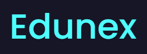
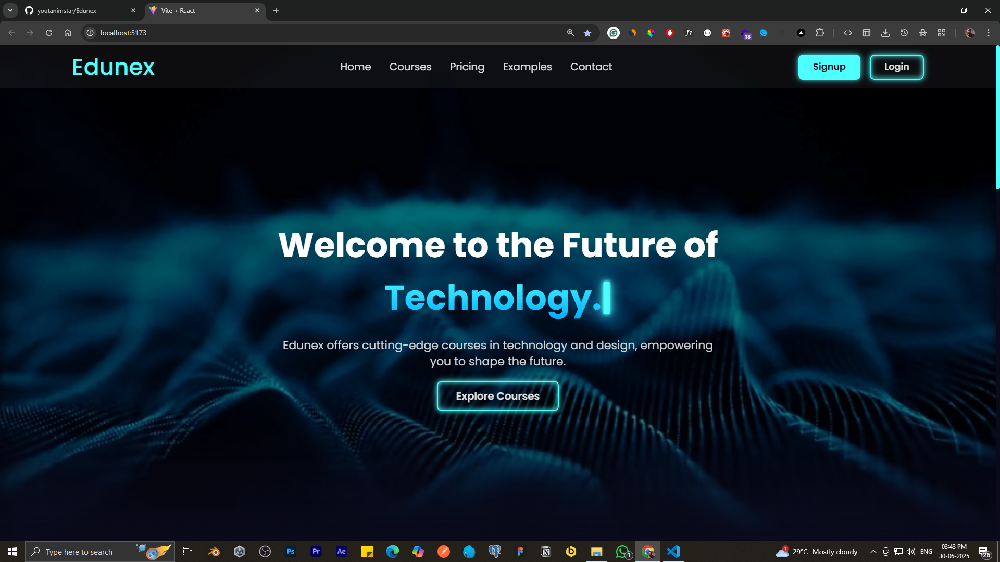
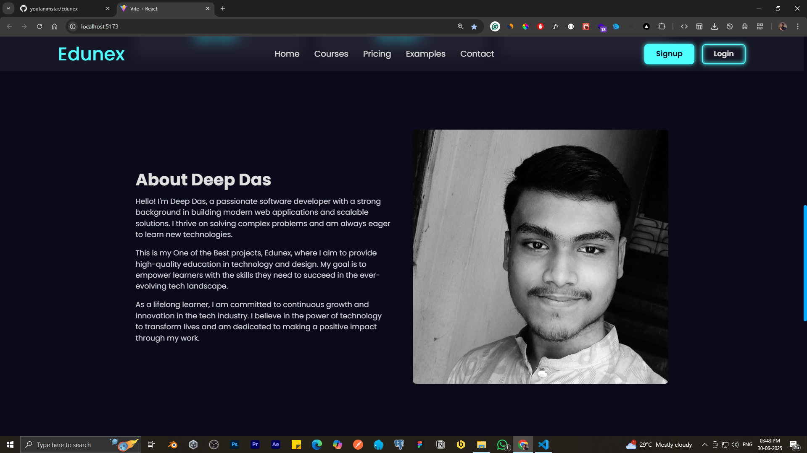
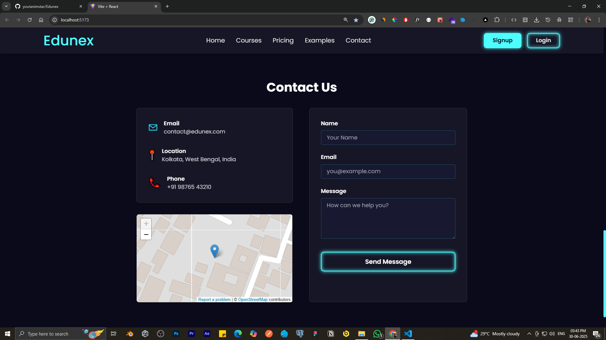
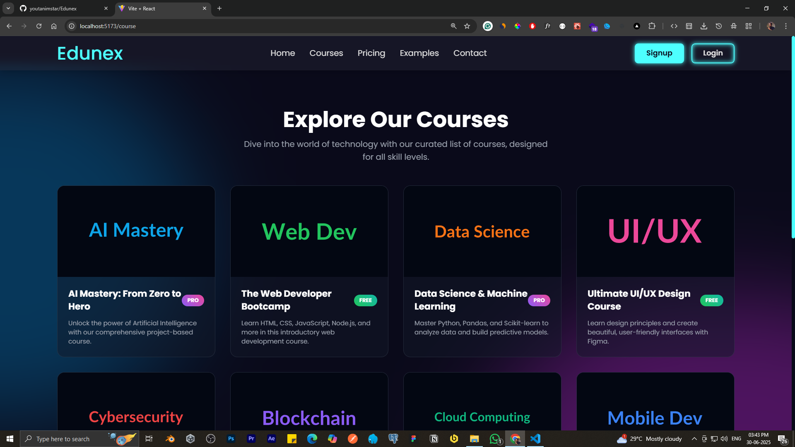
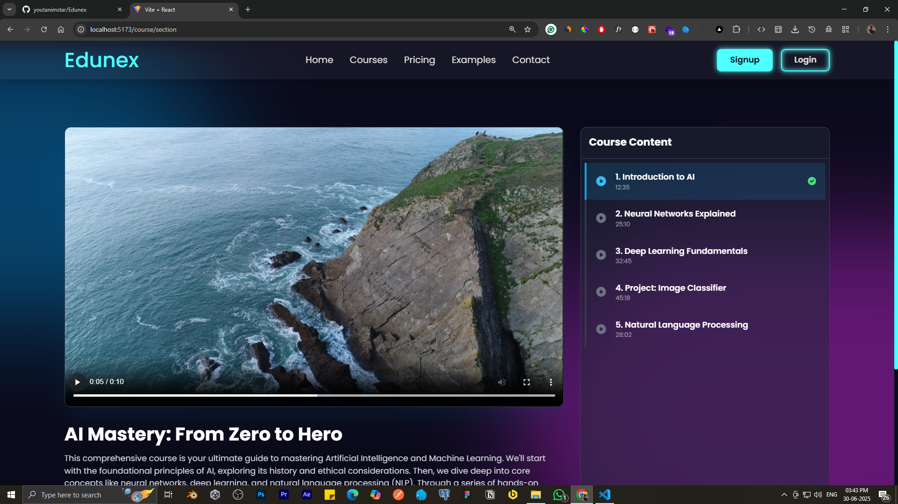
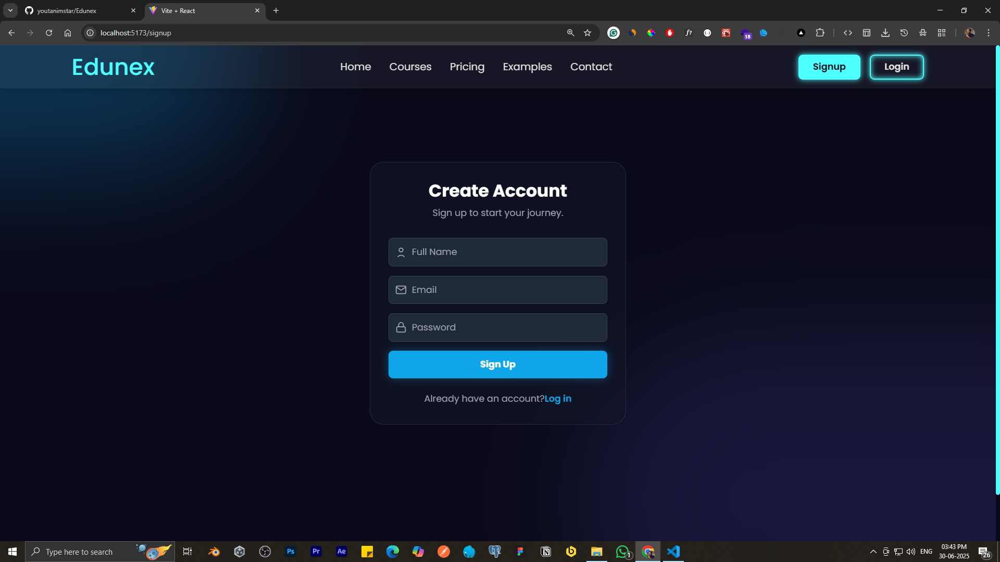
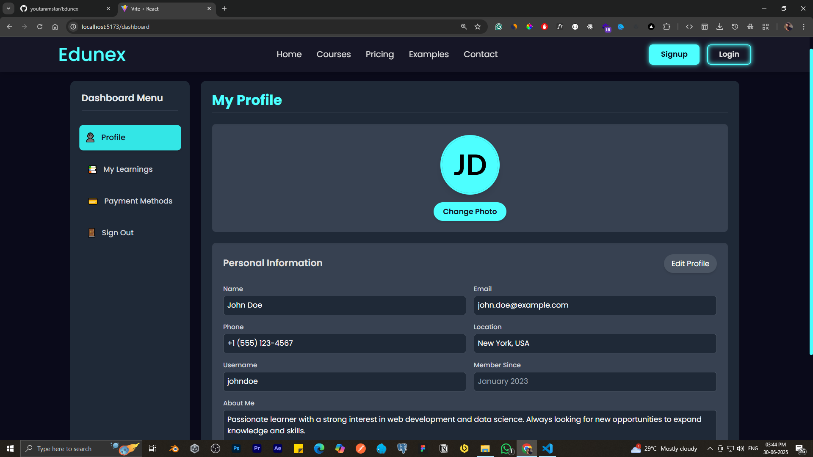

# 🚀 Edunex - Welcome to the Future of Technology Education

<div align="center">
    
</div>
<div align="center">
  
  
  
  
  
</div>

## 📋 Table of Contents

- [🌟 Overview](#-overview)
- [🖼️ Gallery](#️-gallery)
- [✨ Features](#-features)
- [🎯 Course Categories](#-course-categories)
- [📱 Pages & Components](#-pages--components)
- [🛠️ Technologies Used](#️-technologies-used)
- [🚀 Getting Started](#-getting-started)
- [📁 Project Structure](#-project-structure)
- [👨‍💻 About the Developer](#-about-the-developer)
- [📧 Contact](#-contact)
- [🤝 Contributing](#-contributing)
- [📄 License](#-license)


## 🌟 Overview

**Edunex** is a cutting-edge educational platform that offers high-quality courses in technology and design. Our mission is to empower learners with the skills they need to succeed in the ever-evolving tech landscape.

> *"Dive into the world of technology with our curated list of courses, designed for all skill levels."*

## 🖼️ Gallery

Take a look at some screenshots from Edunex:

<div align="center">
    
    
    
    
    
    
    
    
</div>

> *Screenshots showcase the modern UI, course browsing, and personalized dashboard experience.*

## ✨ Features

### 🎓 **Learning Experience**
- 📚 **Comprehensive Courses** - From beginner to advanced levels
- 🎬 **Interactive Video Content** - High-quality video lessons with progress tracking
- 📊 **Progress Tracking** - Monitor your learning journey
- 💎 **Premium & Free Content** - Mix of free and premium courses
- 🏆 **Completion Certificates** - Earn certificates upon course completion

### 👤 **User Management**
- 🔐 **Secure Authentication** - Sign up and login functionality
- 👤 **Personal Dashboard** - Manage your profile and track progress
- 🎯 **Personalized Learning** - Tailored course recommendations
- 💳 **Payment Integration** - Secure payment methods for premium courses

### 🎨 **Modern UI/UX**
- 📱 **Responsive Design** - Perfect experience across all devices
- 🌙 **Modern Dark Theme** - Eye-friendly dark interface
- ⚡ **Fast Loading** - Optimized performance with Vite
- 🎨 **Beautiful Animations** - Smooth transitions and interactions

## 🎯 Course Categories

| Category | Description | Status |
|----------|-------------|--------|
| 🤖 **AI Mastery** | From Zero to Hero - Comprehensive AI and ML course | 💎 PRO |
| 🌐 **Web Development** | HTML, CSS, JavaScript, Node.js, and more | 🆓 FREE |
| 📊 **Data Science** | Python, Pandas, Scikit-learn for data analysis | 💎 PRO |
| 🎨 **UI/UX Design** | Design principles and Figma mastery | 🆓 FREE |
| 🔒 **Cybersecurity** | Protect and secure digital assets | 💎 PRO |
| ⛓️ **Blockchain** | Decentralized technologies and crypto | 💎 PRO |
| ☁️ **Cloud Computing** | AWS, Azure, Google Cloud platforms | 💎 PRO |
| 📱 **Mobile Development** | iOS and Android app development | 💎 PRO |

## 📱 Pages & Components

### 🏠 **Main Pages**
- **Home** (`/`) - Landing page with hero section and course overview
- **Courses** (`/course`) - Browse all available courses
- **Course Detail** (`/course/section`) - Individual course content and videos
- **Login** (`/login`) - User authentication
- **Signup** (`/signup`) - User registration
- **Dashboard** (`/dashboard`) - User profile and learning progress
- **Contact** - Get in touch with our team

### 🧩 **Key Components**
- **Navbar** - Navigation with responsive design
- **Hero Section** - Compelling introduction with call-to-action
- **Course Cards** - Interactive course previews
- **Video Player** - Custom video player with progress tracking
- **Footer** - Links and contact information
- **Authentication Forms** - Secure login/signup forms

## 🛠️ Technologies Used

### Frontend
- ⚛️ **React 18** - Modern React with hooks and context
- 🎨 **Tailwind CSS** - Utility-first CSS framework
- ⚡ **Vite** - Next-generation build tool
- 🛣️ **React Router** - Client-side routing
- 🎯 **ESLint** - Code quality and consistency

### Backend
- 🟢 **Node.js** - JavaScript runtime
- 🚀 **Express.js** - Web application framework
- 🗄️ **Database Integration** - Ready for MongoDB/PostgreSQL
- 🔐 **Authentication** - JWT-based auth system

### Development Tools
- 📦 **NPM** - Package management
- 🔧 **PostCSS** - CSS processing
- 🎨 **Modern JavaScript (ES6+)** - Latest JavaScript features

## 🚀 Getting Started

### Prerequisites
- Node.js (v14 or higher)
- NPM or Yarn package manager

### Installation

1. **Clone the repository**
   ```bash
   git clone https://github.com/yourusername/edunex.git
   cd edunex
   ```

2. **Install Frontend Dependencies**
   ```bash
   cd frontend
   npm install
   ```

3. **Install Backend Dependencies**
   ```bash
   cd ../backend
   npm install
   ```

4. **Start the Development Servers**
   
   **Frontend** (in one terminal):
   ```bash
   cd frontend
   npm run dev
   ```
   
   **Backend** (in another terminal):
   ```bash
   cd backend
   npm start
   ```

5. **Open your browser**
   - Frontend: `http://localhost:5173`
   - Backend API: `http://localhost:3000`

## 📁 Project Structure

```
Edunex/
├── 📁 frontend/
│   ├── 📁 src/
│   │   ├── 📁 components/
│   │   │   ├── 📁 Button/
│   │   │   ├── 📁 Footer/
│   │   │   └── 📁 Navbar/
│   │   ├── 📁 pages/
│   │   │   ├── 📁 Home/
│   │   │   ├── 📁 Course/
│   │   │   ├── 📁 Login/
│   │   │   ├── 📁 Signup/
│   │   │   └── 📁 Dashboard/
│   │   ├── 📁 routes/
│   │   ├── 📁 assets/
│   │   └── 📁 css/
│   ├── 📄 package.json
│   ├── 📄 vite.config.js
│   ├── 📄 tailwind.config.js
│   └── 📄 index.html
├── 📁 backend/
│   ├── 📁 config/
│   ├── 📁 controllers/
│   ├── 📁 routes/
│   ├── 📄 server.js
│   └── 📄 package.json
└── 📄 README.md
```

## 👨‍💻 About the Developer

### Deep Das
*Passionate Software Developer & Technology Enthusiast*

Hello! I'm Deep Das, a passionate software developer with a strong background in building modern web applications and scalable solutions. I thrive on solving complex problems and am always eager to learn new technologies.

**This is one of my best projects, Edunex**, where I aim to provide high-quality education in technology and design. My goal is to empower learners with the skills they need to succeed in the ever-evolving tech landscape.

As a lifelong learner, I am committed to continuous growth and innovation in the tech industry. I believe in the power of technology to transform lives and am dedicated to making a positive impact through my work.

### 🌟 **Vision Statement**
*"To democratize quality tech education and bridge the skills gap in the technology industry."*

## 📧 Contact

### 📬 **Get in Touch**

| Method | Details |
|--------|---------|
| 📧 **Email** | deepdas.it34@gmail.com |
| 📍 **Location** | Howrah, West Bengal, India |
| 📞 **Phone** | +91 8697641505 |
| 🌐 **Website** | [https://edunex-youtanimstar.vercel.app/](https://edunex-youtanimstar.vercel.app/) |

### 💬 **Contact Form**
Visit our contact page to send us a message directly through our website form.

## 🤝 Contributing

We welcome contributions from the community! Here's how you can help:

1. 🍴 **Fork the repository**
2. 🌿 **Create a feature branch** (`git checkout -b feature/amazing-feature`)
3. 💾 **Commit your changes** (`git commit -m 'Add some amazing feature'`)
4. 📤 **Push to the branch** (`git push origin feature/amazing-feature`)
5. 🔄 **Open a Pull Request**

### 📝 **Contribution Guidelines**
- Follow the existing code style
- Write descriptive commit messages
- Add tests for new features
- Update documentation as needed

## 📄 License

This project is licensed under the MIT License - see the [LICENSE](LICENSE) file for details.

---

<div align="center">

### 🌟 **Star this repository if you found it helpful!**

Made with ❤️ by **Deep Das**

*"Empowering the next generation of tech innovators"*

</div>